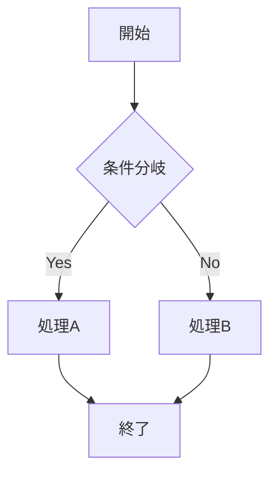
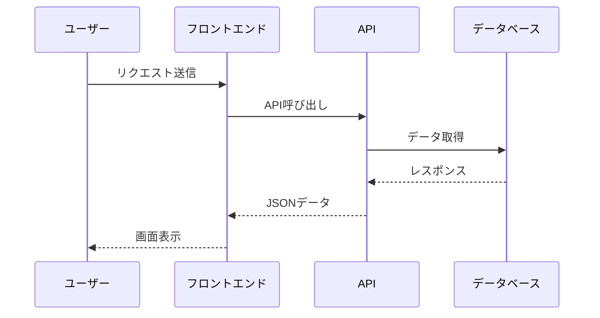

# マークダウン記法テスト

この記事では標準的なマークダウン記法とGFM（GitHub Flavored Markdown）の機能をテストします。

## 基本的なMarkdown

### 見出し

通常の見出しは問題なく表示されるはずです。

### リスト

- 項目1
- 項目2
  - ネストした項目
  - もう一つのネスト

1. 番号付きリスト
2. 二番目の項目
3. 三番目の項目

### コードブロック

通常のコードブロック:

```typescript
function greet(name: string): string {
  return `Hello, ${name}!`
}

const message = greet("World")
console.log(message)
```

### 水平線

---

### テーブル

| ヘッダー1 | ヘッダー2 | ヘッダー3 |
|-----------|-----------|----------|
| セル1     | セル2     | セル3    |
| セル4     | セル5     | セル6    |

### リンク

[これはリンクです](https://github.com)

### 画像


### タスクリスト

- [x] 完了したタスク
- [ ] 未完了のタスク
- [ ] 別のタスク

## 拡張記法

### 引用ブロック

> これは引用ブロックです。
> 複数行にわたる引用も可能です。
>
> > ネストした引用もできます。

### アラート記法

> **Note**: これは情報を伝えるためのノートです。

> **Tip**: これは役立つヒントです。

> **Warning**: これは注意喚起のための警告です。

> **Danger**: これは重要な危険情報です。

### コードブロック内のハイライト

```python
def hello_world():
    print("Hello, World!")
    return 42

# コメント
result = hello_world()
```

### もう一つの画像例


### Mermaid図表のテスト





### HTMLタグの使用

<details>
<summary>クリックして詳細を表示</summary>

これはHTMLの`<details>`タグを使用した折りたたみ可能なコンテンツです。

- マークダウン記法も使用可能
- **太字**や*斜体*もOK
- `コード`も問題なし

```javascript
// コードブロックも動作します
function example() {
  console.log("詳細が展開されました！")
}
```

</details>

### 数式表示

インライン数式: $E = mc^2$

ブロック数式:
$$
\int_{-\infty}^{\infty} e^{-x^2} dx = \sqrt{\pi}
$$

複雑な数式:
$$
\frac{\partial}{\partial t} \Psi(\mathbf{r}, t) = \frac{i\hbar}{2m} \nabla^2 \Psi(\mathbf{r}, t) + V(\mathbf{r}) \Psi(\mathbf{r}, t)
$$

### スタイルの組み合わせ

***太字かつイタリック***

~~取り消し線~~

### エスケープ文字

\*これはアスタリスクです\*

### 脚注

これは本文です[^1]。

[^1]: これは脚注です。

## まとめ

この記事では、標準的なマークダウン記法とGitHub Flavored Markdown（GFM）の様々な機能をテストしました。

サポートされている機能:
- ✅ **基本記法**: 見出し、リスト、リンク、画像
- ✅ **GFM拡張**: テーブル、タスクリスト、取り消し線
- ✅ **コードハイライト**: 多数の言語に対応
- ✅ **数式表示**: KaTeXによる数式レンダリング
- ✅ **HTMLタグ**: details/summaryなど

> **Note**: より高度なZenn独自の記法については、実装の複雑さから今回は標準的なマークダウン機能に絞っています。