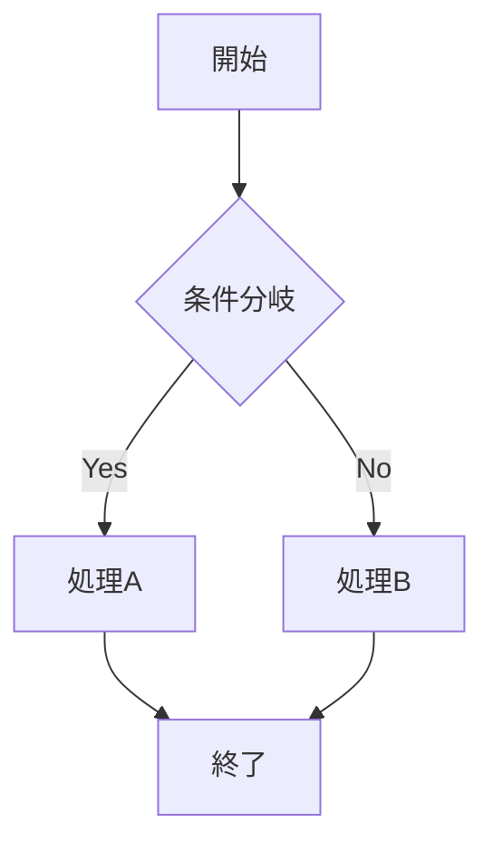
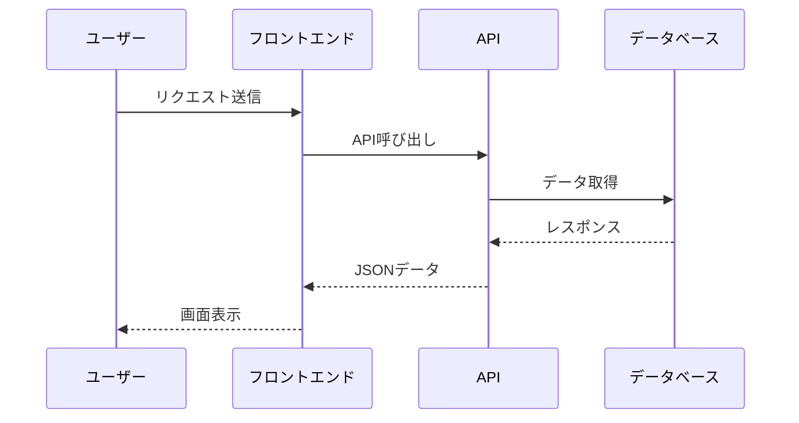

# 概要

この記事では、当ホームページの BLOG 機能にて利用可能なマークダウン記法をメモしておきます。

## マークダウン記法

ここまでで `h1`, `h2` のテストは済んでいます。

### h3

`h3` まで対応しています。

### リスト

- 項目 1
  - 項目 1.1
    - 項目 1.1.1
      - 項目 1.1.1.1
        - 項目 1.1.1.1.1
          - 項目 1.1.1.1.1.1

ネストが深過ぎると見にくいので `x.y.z` くらいまでにしましょう。

1. 番号付きリスト
2. 項目 2
3. 項目 3

番号付きリストのネストには今後対応予定。

### コードブロック

```typescript
function greet(name: string): string {
  return `Hello, ${name}!`
}

const message = greet("World")
console.log(message)
```

### 水平線

---

### テーブル

|ヘッダー1|ヘッダー2|ヘッダー3|
|-|-|-|
|セル1|セル2|セル3|
|セル4|セル5|セル6|

### リンク

[これはリンクです](https://github.com/hashiiiii)

### 画像


### タスクリスト

- [x] 完了したタスク
- [ ] 未完了のタスク

### 引用ブロック

> これは引用ブロックです。
> 複数行にわたる引用も可能です。
>
> > ネストした引用もできます。

### アラート記法

> **Note**: note です。

> **Tip**: tip です。

> **Warning**: warning です。

> **Danger**: danger です。

### Mermaid 図表のテスト





### HTML タグの使用

<details>
<summary>クリックして詳細を表示</summary>

これは HTML の `<details>` タグを使用した折りたたみ可能なコンテンツです。

- マークダウン記法も使用可能
- **太字** や *斜体* も OK
- `コード` も問題なし

```javascript
// コードブロックも動作します
function example() {
  console.log("詳細が表示されました！")
}
```

</details>

### 数式表示

インライン数式: $E = mc^2$

ブロック数式:
$$
\int_{-\infty}^{\infty} e^{-x^2} dx = \sqrt{\pi}
$$

複雑な数式:
$$
\frac{\partial}{\partial t} \Psi(\mathbf{r}, t) = \frac{i\hbar}{2m} \nabla^2 \Psi(\mathbf{r}, t) + V(\mathbf{r}) \Psi(\mathbf{r}, t)
$$

### スタイルの組み合わせ

***太字かつイタリック***

~~取り消し線~~

### エスケープ文字

\*アスタリスクをエスケープしなかったら、この文章はイタリックになっています。\*

### 脚注

これは本文です[^1]。

[^1]: 脚注を本文につけると、このセクションは機械的に作成されます。
