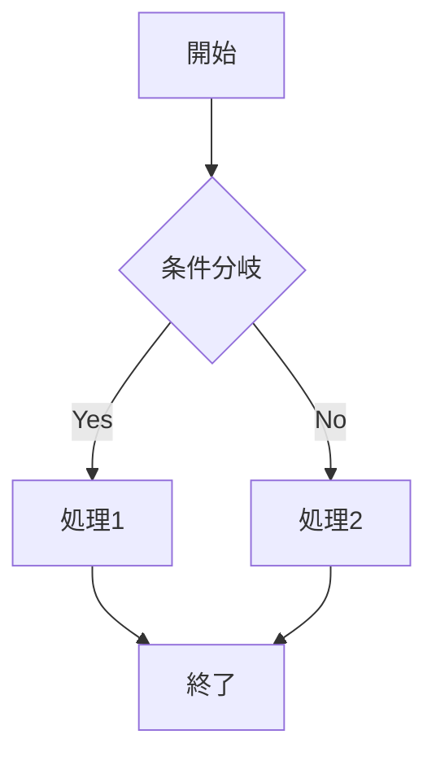
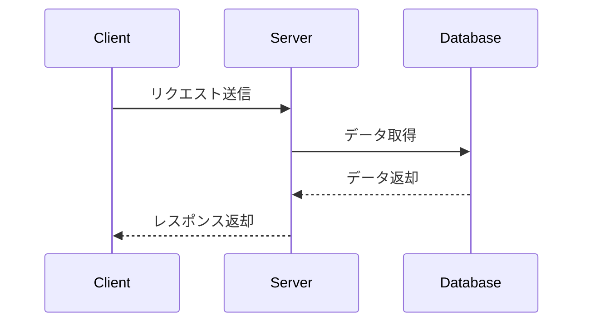

# Zenn 拡張構文テスト

この記事では、Zenn Editorの拡張構文が正しく動作するかをテストします。

## メッセージボックス

### 通常のメッセージ

:::message
これは通常のメッセージボックスです。重要な情報を強調表示するために使用します。
:::

### 警告メッセージ

:::message alert
これは警告メッセージボックスです。注意が必要な情報を表示します。
:::

## アコーディオン（折りたたみ）

:::details クリックして展開
折りたたみコンテンツがここに表示されます。

- 項目1
- 項目2
- 項目3

詳細な説明や追加情報をここに記載できます。
:::

## ネストされたコンテナ

::::details 外側のタイトル
これは外側のコンテナです。

:::message
ネストされたメッセージボックスです。
複数のコンテナを組み合わせることができます。
:::

::::

## コードブロック

### TypeScript

```typescript
interface User {
  id: number;
  name: string;
  email: string;
}

function greet(user: User): string {
  return `Hello, ${user.name}!`;
}

const user: User = {
  id: 1,
  name: 'Taro',
  email: 'taro@example.com',
};

console.log(greet(user));
```

### Python

```python
def fibonacci(n):
    if n <= 1:
        return n
    return fibonacci(n-1) + fibonacci(n-2)

# フィボナッチ数列の最初の10項
for i in range(10):
    print(f"F({i}) = {fibonacci(i)}")
```

## 数式

### インライン数式

アインシュタインの質量とエネルギーの等価性: $E = mc^2$

### ブロック数式

ガウス積分の公式:

$$
\int_{-\infty}^{\infty} e^{-x^2} dx = \sqrt{\pi}
$$

オイラーの公式:

$$
e^{i\pi} + 1 = 0
$$

## テーブル

| 言語       | 難易度 | 用途                   |
| ---------- | ------ | ---------------------- |
| TypeScript | あ     | Web開発                |
| Python     | い     | データ分析、機械学習   |
| Rust       | う     | システムプログラミング |
| Go         | え     | バックエンド開発       |

## リスト

### 順序なしリスト

- 項目1
  - サブ項目1.1
  - サブ項目1.2
    - サブサブ項目1.2.1
- 項目2
- 項目3

### 順序付きリスト

1. 最初のステップ
2. 次のステップ
3. 最後のステップ

### タスクリスト

- [x] 完了したタスク
- [x] これも完了
- [ ] 未完了のタスク
- [ ] これも未完了

## 引用

> これは引用文です。
> 複数行にわたって引用することができます。
>
> — 著者名

## 水平線

以下は水平線です。

---

## Mermaid図表

### フローチャート



### シーケンス図



## リンク

[Zenn公式サイト](https://zenn.dev)

[GitHub](https://github.com)

## 画像

### 通常の画像


### 画像サイズ指定（Zenn記法）

幅250pxに指定：


幅を指定せず高さ200pxに指定：


## コードブロック（ファイル名付き）

### TypeScriptファイル名表示

```typescript:sample.ts
interface User {
  id: number;
  name: string;
}

const user: User = { id: 1, name: 'John' };
```

### Pythonファイル名表示

```python:main.py
def hello(name: str) -> str:
    return f"Hello, {name}!"

print(hello("World"))
```

## 脚注のテスト

これは脚注のテストです[^1]。複数の脚注も使えます[^2]。

[^1]: これは1つ目の脚注です。
[^2]: これは2つ目の脚注です。詳細な説明を書くこともできます。

## 埋め込みコンテンツ

### YouTubeの埋め込み

https://www.youtube.com/watch?v=dQw4w9WgXcQ

### Twitterの埋め込み

https://twitter.com/jack/status/20

### GitHubリポジトリの埋め込み

https://github.com/zenn-dev/zenn-editor

### CodePenの埋め込み

@[codepen](https://codepen.io/sosuke/pen/Pjoqqp)

## インラインコード

`const greeting = 'Hello, World!';` のようにインラインでコードを記述できます。

## リンクカード

単独行のURLはリンクカードとして表示されます：

https://zenn.dev

## まとめ

この記事では、Zenn Editorの主要な拡張構文をテストしました。

:::message
すべての構文が正しく表示されていれば、Zenn Editor統合は成功です！
:::
